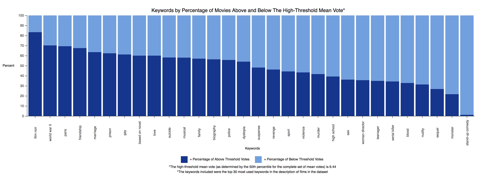
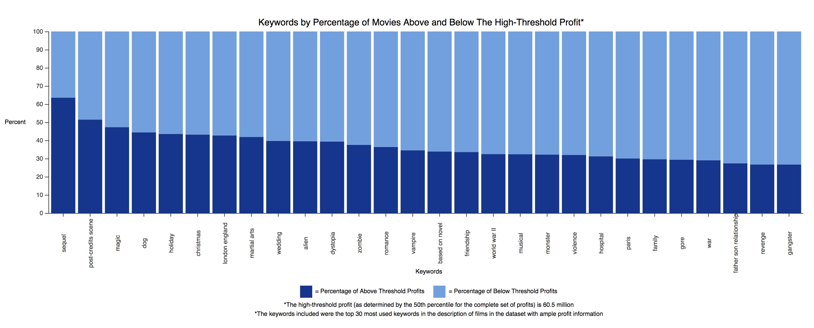

# Tech Report

### Hypothesis ###

#### A defined hypothesis or prediction task, with clearly stated metrics for success ####
The overarching question we are trying to answer is: what is the average user rating and profit of a movie based on its characteristics? Specifically, for this analysis deliverable, we are answering the questions of: 1) based on the keywords associated with a movie, is a movie’s mean user rating above or below the 70th percentile mean user rating for all movies? 2) based on the keywords associated with a movie, is a movie’s profit above or below the 70th percentile profit for all movies? Thus, a movie is considered successful if its average user rating is above the 70th percentile of average user rating or its profit is above the 70th percentile of profit. We chose 70th percentile--rather than average--thresholds for mean user rating and profit rather than averages because we felt it would be more meaningful to have higher thresholds for movie success. It is more meaningful to know that a movie will be in the top 30% of all movies in terms of profit and/or average user rating, than to simply be above the average. This is a prediction task, with our primary metric of success being that our prediction algorithm predicts whether movies are above or below the rating or profit thresholds in our testing dataset with an accuracy of 70%. Our secondary metric of success was to minimize the false positive rate, as we felt false positives would be more harmful than false negatives.

### ML/Test Method ###

#### Why did you use this statistical test or ML algorithm? ####

We wanted to determine whether a movie was going to be above or below the 70th percentile mean rating threshold, as well as the 70th percentile profit threshold, based on its keywords. We used the Naive Bayesian Classifier, an ML technique, because there are over 150,000 movie-keyword pairs in our keywords dataset and almost 20,000 different keywords. Since there are so many variables, we felt that this technique was the best technique, out of the ones we have been taught, to tackle this question. As stated above, a success for this algorithm was achieving an accuracy with the testing data of 70%, as well as achieving a low false positive rate (i.e., 15% or lower). These target metrics for success are moderate values; we wanted to shoot for a relatively high accuracy rate, but we also knew that with an imperfect algorithm--this is explained in further detail in the next paragraph--the accuracy rate would not be near 100%. We also wanted a low false positive rate because we felt that it is harmful to believe that movies will be above a threshold when they are not. With a low false positive rate, however, there is likely to be a high false negative rate; therefore, we did not want a false positive rate that was too low, such that the false negative rate was overwhelmingly high.

#### Which other tests did you consider or evaluate? ####
We also considered and attempted to carry out an ordinary least squares multiple regression model for the prediction of the average movie rating (our dependent variable) based on a number of independent variables that we thought might contribute to a movie’s success.
In this attempt, the question we were trying to answer was: what is the average user rating of a movie based on the number of popular actors who star in the movie (a popular actor is defined as an actor who has starred in more than 10 films), whether the movie was part of a series or not, the runtime of the movie in minutes, the genre of the movie, the season of the year during which the movie was released, whether the movie was produced by a popular production company (defined as a production company which has produced more than 35 movies), whether the film had a popular director (defined as a director who has directed more than 30 movies), and whether the movie was produced in the United States or not? For the indicator variables--such as whether the movie was produced by a popular production company or directed by a popular director--the thresholds were determined manually by inspecting the distribution of the data (eg. the number of movies produced by each unique production company).

Unfortunately, this initial model had a very low r-squared value, even after removing some variables with high p-values. We plan to continue working on this model by adjusting the independent variables. We will also experiment with different dependent variables, such as profit, as the primary indicator of success to see whether we can get better prediction results.

#### How did you measure success or failure? Why that metric/value? #####

For the multiple regression model, we measured success by the r-squared value and whether coefficients were statistically significant or not. We used this metric because if a coefficient is not statistically significant, that means that its corresponding independent variable’s effect on the dependent variable is statistically indistinguishable from 0 using a 95% confidence interval, or an alpha of 0.05. For the Naive Bayes Classifier, as stated, we used the overall accuracy, false positive, and false negative rates. These metrics are relatively standard for these types of models/tests and because our use-case did not deviate significantly from standard applications of these tests, these metrics were most appropriate.

#### What challenges did you face evaluating the model? ####
One of the downsides of our Naive Bayesian Classifier is the assumption that the association of each keyword with a movie is independent from the association of another keyword with the same movie; this assumption is likely not true, as the keywords associated with a movie are likely also to be associated with each other. This was a challenge in achieving high accuracy.

#### Did you have to clean or restructure your data? ####
In order to carry out the Naive Bayes classification, we had to clean the data such that instead of having the raw mean vote, we had a binary variable, with values 0 or 1, which labeled each movie as being below or above the 70th percentile of mean rating of all movies, respectively. We also had to add a column to the all_movies table, called “profit” in order to calculate the 70th percentile of profit. Additionally, as was done with the mean user rating, we created a binary variable with values 0 or 1, which labeled each movie as being above or below the 70th percentile of profit threshold. We also had to join two of our tables together, all_movies and keywords, so that we only considered movies that had keywords associated with them.

To use our dependent variables in the multiple regression model, we had to further clean our data and create a variety of indicator variables from our categorical values. We restructured the “genre” variable and deconstructed it into multiple indicator variables. We also had to change the “series” variable values from “YES” and “NO” to 1 and 0, respectively. Additionally, we used the “month” variable to get the season of the year during which the film was released (months 12, 1, and 2 were winter; 3-5 were spring; 6-8 summer, 9-11 were fall) and we constructed three indicator variables. For determining whether the movie was produced in the United States, we created a new indicator variable, which was equal to 1 if the film’s “country” value included “USA” and 0 if not.

### Result Interpretation ###

#### What is your interpretation of the results? Are you satisfied with your prediction accuracy? ####

Our Naive Bayesian Classifier was able to correctly classify approximately 74%-76% of the testing data, with a false positive rate of approximately 10%-13% and a false negative rate of approximately 35 - 38%. Our classifier’s accuracy is not below the baseline performance accuracy of 50% (i.e. randomly assigning movies above or below the threshold) and we have surpassed our accuracy rate target. Although this prediction accuracy could be improved, our current accuracy rate is not surprising. As stated above, the Naive Bayesian Classifier technique assumes that the keywords for a single movie are independent from each other. This assumption, however, is likely not true for our dataset since it is likely that the keywords for a single movie are related to each other. Intuitively, while the accuracy rate for this Naive Bayesian Classifier is moderate, we understand why.

#### How do you react to the results? Are you confident in the results? ####

When comparing different percentile thresholds to use in the Naive Bayes model, we noticed that the overall accuracy increased as the threshold deviated above or below the average value for the success metric (movie rating or profit). We decided to use a threshold of 0.7 in our model because we felt that it was more meaningful to predict whether a movie would be above the 70th percentile than to predict simply whether it would be above the 50th percentile. Furthermore, even though using the 70th percentile of ratings or profits as a threshold gives us a higher false negative rate (and conversely, a lower false positive rate), we believe prioritizing a lower false positive rate is preferable in this context. This is because we would rather have a model that misses some high-potential movies (based on keywords) than a model that frequently classifies movies as likely to be successful when, in fact, they may not be.

### Visualization ###

#### Why did you pick this graph? ####

Our graph related to our Naive Bayes prediction model shows the top 30 most common keywords and for each keyword, what percent of movies with that keyword had profits (or ratings) above the 50th (or 70th) percentile profit (or rating). Keywords (although all picked from the top 40 keywords) in each plot do vary based on available information and sorting in visualization. We thought this visualization format was a fitting way to visualize the data because it directly reflects the inputs (keywords) and outputs (above or below threshold profits/ratings) for our Naive Bayes model, and also gives the viewer additional perspective into the dataset by exploring the distribution of common keywords in the data. Lastly, it shows which themes in a movie might indicate success for that movie. For instance, we saw that sequels tend to have the highest percentage of movies with profits above the threshold. On the other hand, movies with the keyword stand-up comedy have the lowest percentage of movies with mean ratings about the 50th percentile mean rating.

#### What alternative ways might you communicate the result? ####
We also used scatterplots to visualize average male vote vs. average female vote, average U.S. vote vs. average foreign vote, and profits vs. mean vote for a given movie. The scatterplot format was fitting for these visualizations because we wanted to show simple correlation relationships between the values on the two axes. Finally, we used box and whisker plots to visualize the distribution of profits for top production companies, top directors, top script writers, and movies by number of popular actors (where a popular actor is an actor in more than 10 movies). This format was useful as it allowed us to visualize the spread of the independent variables with respect to our success metric (profit) and also to identify outliers which may affect the mean profit values.

#### Will your visualization require text to provide context or is it standalone? ####
Many of our graphs stand alone (with proper axes and titles), while a few require additional explanation of key terms, which we provide below the graphs.

### Results ###
Naive Bayes Test
|   | 70th Percentile Mean Rating  | 70th Percentile Mean Profit  |
|---|---|---|
|  Threshold | 7.2  | 71,971,200.00  |
|Number of training data points (number of movies)|19528|3921|
|Number of testing data points (number of movies) |4887 | 1001|
|Probability that Y=1| 0.23120647275706677|0.24483550114766642 |
|Accuracy |0.7646818088807039 |0.7452547452547452 |
|False positive rate |0.10644855381697486 |0.13914027149321267 |
|False negative rate |0.38537658053875756 |0.3548387096774194 |

### Machine Learning Test ###

#### Does your data have any sensitive/protected attributes that could affect your machine learning model? ####
Our data may have a few protected attributes that could affect the accuracy, bias, or generalization of our model. For example, groups that are historically underrepresented as directors in Hollywood may have fewer directoral projects to their name, despite being highly competent and qualified. As such, our current method of assessing “popular director” (whether a director has produced > 30 movies) could potentially serve to perpetuate existing biases in Hollywood by simply measuring the success of a director by the number of movies they have previously produced. In fact, from our keywords analysis visualization, we see that only roughly 35% of movies with the keyword “woman director” had above-average reviews. Other variables such as race of actors and directors may also be protected attributes that are present in the data through various proxies.

#### Discussion of visualization/explaining your results on a poster and a discussion of future directions ####
As discussed, we plan to continue working to improve the Naive Bayes and Multiple Regression models. For the multiple regression model, we aim to improve the independent variables used for analysis and once our model is fitting the data more closely (with an improved r-squared), we plan to analyze how strongly different independent variables influence our metric of success (profit or ratings) using correlation coefficients and p-values. We may also use a few statistical tests for a variety of hypotheses, such as whether a particular genre (such as romance or action) has a higher rating by men or women, or whether movies in a series tend to be more highly rated.

For our poster, we plan to include results from our Naive Bayes classifier, multiple regression model, as well as a few statistical tests, if possible. We plan to include the visualizations from our analysis deliverable that are most relevant to our models’ results, as well as visualizations that document our regression results (eg. predicted vs. residual values).  
